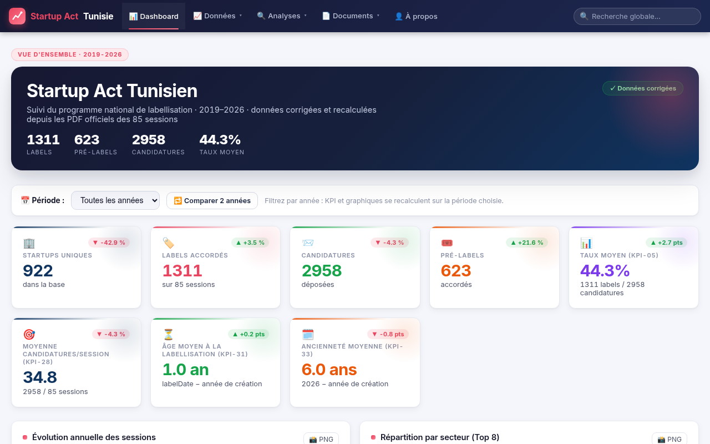
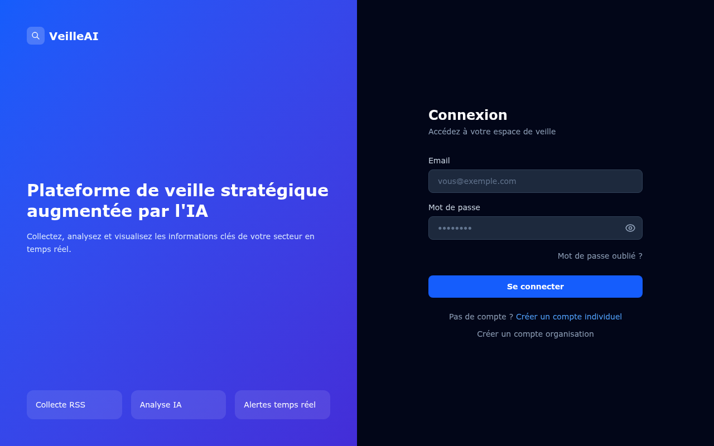

<!-- ====================== HEADER ====================== -->
<div align="center">


# Faker BEN NOOMEN

#### `Full-Stack Engineer` · `Veille & Intelligence Compétitive` · `Data & IA`


<br/>

<p>
  <a href="https://linkedin.com/in/fakerbennoomen"></a>
  <a href="https://github.com/bennoomenfaker"></a>
  <a href="mailto:fakerbennoomen@gmail.com"></a>
</p>

</div>

<!-- ====================== ABOUT ====================== -->
## 👋 À propos

```ts
const faker = {
  role:      "Full-Stack Engineer",
  location:  "🇹🇳 Tunis, Tunisie",
  focus:     ["Plateformes web", "Veille & Intelligence Compétitive", "Data & IA"],
  loves:     ["NestJS", "React", "Spring Boot", "Machine Learning", "Open Source"],
  currently: "Master VIC — Veille & Intelligence Compétitive (ESEN Manouba × ISCAE Manouba)",
  motto:     "Build it clean, ship it fast, scale it right.",
};
```

- 🎓 Mastère Professionnel **VIC — Veille & Intelligence Compétitive** (ESEN Manouba × ISCAE Manouba)
- 🎓 Mastère **DDS — Digitalisation des Services** (ESSECT Tunis) · Licence **E-Business**
- 💼 Expériences : Hôpital Habib Thameur (maintenance prédictive ML), ISIMS Sfax, BIAT
- 💬 Demandez-moi : **TypeScript, NestJS, Next.js, React, Spring Boot, Machine Learning**

<!-- ====================== TECH STACK ====================== -->
## 🛠️ Tech Stack

<table align="left">
  <tr>
    <td align="center" width="120"><b>Languages</b></td>
    <td align="left">
      <a href="https://skillicons.dev"></a>
    </td>
  </tr>
  <tr>
    <td align="center" width="120"><b>Frontend</b></td>
    <td align="left">
      <a href="https://skillicons.dev"></a>
    </td>
  </tr>
  <tr>
    <td align="center" width="120"><b>Backend</b></td>
    <td align="left">
      <a href="https://skillicons.dev"></a>
    </td>
  </tr>
  <tr>
    <td align="center" width="120"><b>Databases</b></td>
    <td align="left">
      <a href="https://skillicons.dev"></a>
    </td>
  </tr>
  <tr>
    <td align="center" width="120"><b>AI / Data</b></td>
    <td align="left">
      
      
      
      
    </td>
  </tr>
  <tr>
    <td align="center" width="120"><b>DevOps</b></td>
    <td align="left">
      <a href="https://skillicons.dev"></a>
    </td>
  </tr>
</table>

<br clear="all"/>

<!-- ====================== PROJECTS ====================== -->
## 🚀 Projets phares

```bash
$ git log --author="bennoomenfaker" --oneline --shortstat
★  vic-2026-startup-act      étude quantitative des 85 sessions de labellisation Startup Act (2019-2026)
★  veille-stratégique-ia     plateforme de veille stratégique augmentée par l'IA (Ollama / Mistral / Groq)
```

<div align="center">

[`vic-2026-startup-act`](https://github.com/bennoomenfaker/vic-2026-startup-act) · [`veille-ia`](https://github.com/bennoomenfaker/Plateforme-de-veille-strat-gique-augment-e-par-l-IA)

</div>

### 🇹🇳 Étude Quantitative — Startup Act Tunisie (2019-2026)

Analyse des **85 sessions de labellisation** (Loi 2018-20), rapports annuels, parcours **prélabel → label** et **veille comparative internationale** (StartupBlink). **2 958 candidatures · 1 311 labels · 623 prélabels · 502 conversions (80,6 %)**.

[](https://github.com/bennoomenfaker/vic-2026-startup-act/actions)
[](https://vic-esen-iscae-2026-startup-act.onrender.com/)

[](https://vic-esen-iscae-2026-startup-act.onrender.com/)

**Stack** : Python · Chart.js · Leaflet · GitHub Actions · Render

### 🤖 Plateforme de veille stratégique augmentée par l'IA

Veille (technologique, concurrentielle, réglementaire…) : objectifs, axes et hypothèses, **collecte multi-sources** (RSS, Web, API, PDF), **enrichissement IA** multi-modèle (Ollama / Mistral / Groq en fallback), évaluation des hypothèses et visualisation des insights (dashboard, ReactFlow, Kanban).

[](http://91.134.139.163:8080/)

[](http://91.134.139.163:8080/)

**Stack** : React 19 · Vite · Tailwind · NestJS · Prisma · PostgreSQL 15 · Ollama · Docker

<!-- ====================== STATS ====================== -->
## 📊 GitHub Stats

<div align="center">


</div>

<!-- ====================== CONTRIBUTIONS ====================== -->
## 🐍 Contribution Graph

<div align="center">

<picture>
  <source media="(prefers-color-scheme: dark)" srcset="https://raw.githubusercontent.com/bennoomenfaker/bennoomenfaker/output/github-contribution-grid-snake-dark.svg"/>
  <source media="(prefers-color-scheme: light)" srcset="https://raw.githubusercontent.com/bennoomenfaker/bennoomenfaker/output/github-contribution-grid-snake.svg"/>
  
</picture>

</div>

<!-- ====================== QUOTE ====================== -->
<div align="center">

<picture>
  <source media="(prefers-color-scheme: dark)" srcset="https://quotes-github-readme.vercel.app/api?type=horizontal&theme=tokyonight"/>
  <source media="(prefers-color-scheme: light)" srcset="https://quotes-github-readme.vercel.app/api?type=horizontal&theme=light"/>
  
</picture>

</div>

<!-- ====================== FOOTER ====================== -->
## 🤝 Restons en contact

```bash
$ echo "Construisons quelque chose de grand ensemble 🚀"
$ whoami
> faker-bennoomen · ouvert aux collaborations, open-source & idées SaaS
```

<div align="center">

<a href="https://linkedin.com/in/fakerbennoomen"></a>
<a href="https://github.com/bennoomenfaker"></a>
<a href="mailto:fakerbennoomen@gmail.com"></a>


</div>
